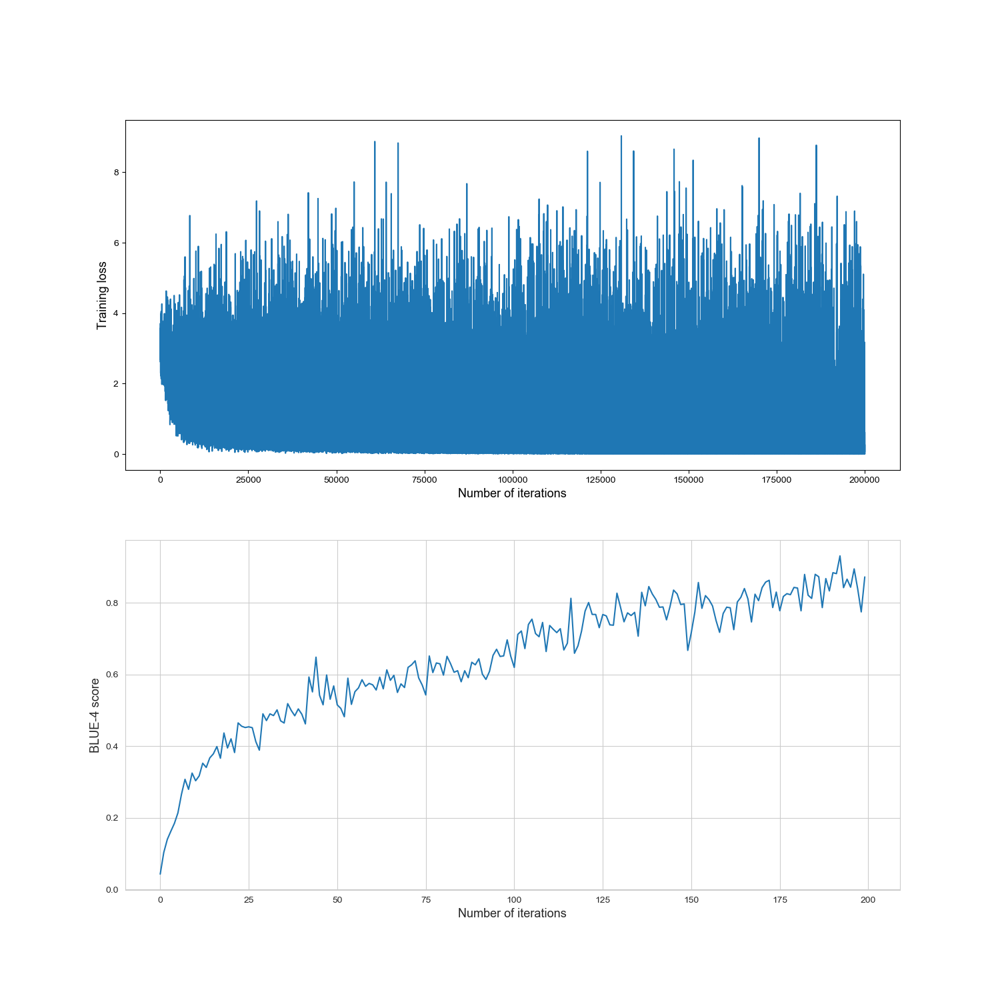

# English-Spelling-Correction-using-Seq2Seq
implement a seq2seq recurrent neural network for English spelling correction, E.g. ‘recetion’ to ‘recession’

#### Dataset Desriptions
=========================	train.json =========================
1. training dataset
2. file length: 7461
3. data size: 12925
\\
=========================	test.json =========================
1. testing dataset
2. file length: 50
3. data size: 50
=========================	File descriptions	=========================
1. There are two indexes for dictionary (.json), 'input' and 'target'
2. Each 'input' has multiple error words. e.g. ['varable', 'vareble', ...]
3. Each 'target' has only one correct word. e.g. 'variable'
4. In test.json, 'input' has only one error word. e.g. ['varable']

#### Results

